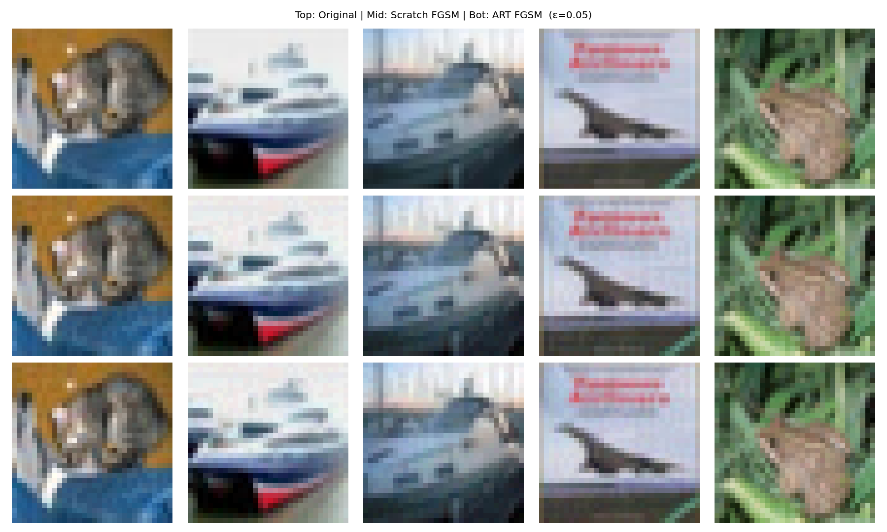
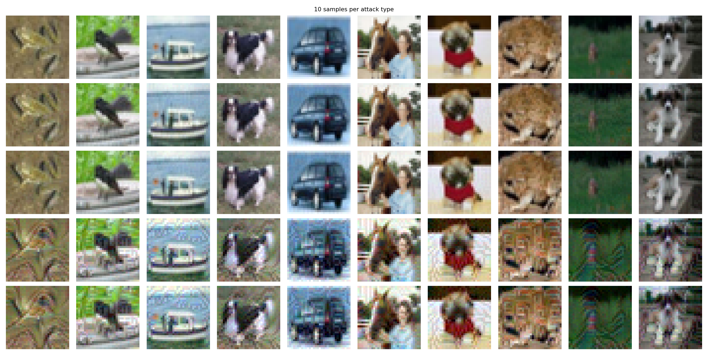

# Assignment 5 - ViT LoRA & Adversarial Robustness
Hugging face link :https://huggingface.co/bappaiitj/vit_lora
wandb links1:https://wandb.ai/b23cm1038-prom-iit-rajasthan/Assignment-5-vit_lora?nw=nwuserb23cm1038
wandb link 2:https://wandb.ai/b23cm1038-prom-iit-rajasthan/Ass_5_Adversarial/runs/1vq2a9rf?nw=nwuserb23cm1038

## Installation
Run the following commands in the root of this project:


build and run using Docker:
```bash
docker build -t ass5 .
```

## Running the Code

Ensure you log in to WandB and HuggingFace Hub (optional, but required for pushing) before running the training:
```bash
wandb login
huggingface-cli login
```

### Q1: ViT Finetuning with LoRA Search
```bash
python q1_vit_lora.py
```
This script will:
1. Finetune a ViT head (without LoRA) for 10 epochs.
2. Perform an Optuna grid search for LoRA parameters (Rank: 2,4,8 and Alpha: 2,4,8).
3. Log all Training/Validation Loss and Accuracy graphs to WandB.
4. Save the best Model and conditionally push it to your HuggingFace namespace.

### Q2: Adversarial Attacks and Detectors
```bash
python q2_adversarial.py
```
This script will:
1. Train a ResNet18 on CIFAR-10 from scratch (>72%).
2. Apply FGSM Attack natively and via IBM ART.
3. Output the accuracy and perturbation metrics.
4. Generate the qualitative image samples `fgsm_comparison.png` and `all_10_samples.png`.
5. Train ResNet34 Detectors for PGD and BIM and save their weights in `q2_weights/`.

## Results
*Note: Run the scripts to auto-populate the exact accuracy logs to your WandB repository.*

**WandB Link**: <insert_wandb_link>  
**HuggingFace HUB Link**: <insert_hf_link>

---

### Q1 Table: LoRA Hyperparameter Search Results

| LoRA Layers | Rank | Alpha | Dropout | Overall Test Accuracy | Trainable Parameters |
|-------------|------|-------|---------|-----------------------|----------------------|
| Without     | N/A  | N/A   | N/A     | 79.56%                | 38,500               |
| With        | 2    | 2     | 0.1     | 89.98%                | 75,364               |
| With        | 2    | 4     | 0.1     | 89.77%                | 75,364               |
| With        | 2    | 8     | 0.1     | 89.64%                | 75,364               |
| With        | 4    | 2     | 0.1     | 90.01%                | 112,228              |
| With        | 4    | 4     | 0.1     | 90.08%                | 112,228              |
| With        | 4    | 8     | 0.1     | 90.00%                | 112,228              |
| With        | 8    | 2     | 0.1     | 89.81%                | 185,956              |
| With        | 8    | 4     | 0.1     | **90.28%**     | 185,956              |
| With        | 8    | 8     | 0.1     | 90.22%                | 185,956              |

### Q1 Best LoRA Config: Epoch-wise Training Metrics
**Best Configuration — Rank: 8, Alpha: 4, Dropout: 0.1**

| Epoch | Train Loss | Val Loss | Train Accuracy | Val Accuracy |
|-------|------------|----------|----------------|--------------|
| 1     | 0.6719     | 0.3826   | 82.45%         | 87.99%       |
| 2     | 0.2754     | 0.3535   | 91.32%         | 89.42%       |
| 3     | 0.1957     | 0.3550   | 93.62%         | 89.51%       |
| 4     | 0.1397     | 0.3554   | 95.57%         | 89.71%       |
| 5     | 0.0975     | 0.3643   | 97.04%         | 89.73%       |
| 6     | 0.0688     | 0.3691   | 98.11%         | 89.95%       |
| 7     | 0.0501     | 0.3786   | 98.85%         | 89.74%       |
| 8     | 0.0382     | 0.3774   | 99.27%         | 89.90%       |
| 9     | 0.0318     | 0.3786   | 99.46%         | 89.83%       |
| 10    | 0.0286     | 0.3790   | 99.60%         | 89.87%       |

---

### Q2: FGSM Attack Comparison (Scratch vs IBM ART)

**Clean ResNet18 Baseline Accuracy: 78.92%**

| FGSM Epsilon (ε) | Scratch Accuracy (%) | ART Accuracy (%) | Accuracy Drop — Scratch | Accuracy Drop — ART |
|------------------|----------------------|------------------|-------------------------|---------------------|
| 0.01             | 62.67                | 70.90            | -16.25                  | -8.02               |
| 0.05             | 18.73                | 28.93            | -60.19                  | -49.99              |
| 0.10             | 7.39                 | 16.75            | -71.53                  | -62.17              |

**Perturbation strength vs performance drop:**  
As perturbation strength (ε) increases, model accuracy declines sharply for attacks implemented from scratch (falling from 78.92% to 7.39%). Using IBM ART similarly degrades performance, though ART achieves a slightly more controlled degradation profile (down to 16.75%).

### Q2 Table: Adversarial Detector Accuracy

| Attack Type | Detector Model | Test Accuracy |
|-------------|----------------|---------------|
| PGD         | ResNet34       | 99.91%     |
| BIM         | ResNet34       | 100.00%    |

Both detectors far exceed the required ≥70% detection threshold.

---

### Visual Comparison



